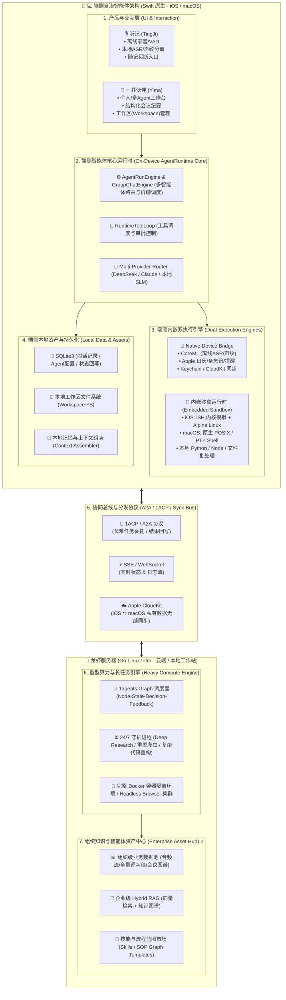

# 1agents 全栈技术架构与演进方案
> **端侧自治沙盒运行时 + 龙虾服务器（端云协同） + 智能体资产沉淀体系**

---

## 1. 业务愿景与四阶段演进路线

基于以“日常记录与灵感”为切入口、逐步构建个人到组织级智能体网络的战略，产品分为四个递进阶段：

```text
阶段一：记录当下 ──> 阶段二：文字整理 ──> 阶段三：待办执行 ──> 阶段四：企业级沉淀
  (听记 App)        (一芥伙伴)        (端云协同/龙虾)     (AI 原生解决方案)
```

| 阶段 | 核心产品形态 | 商业与产品定位 | 核心能力特征 |
| :--- | :--- | :--- | :--- |
| **阶段一：记录当下** | **“听记” (TingJi)** | 手机端离线语音记事，**一次性买断**，主打低成本、高可靠、极致隐私 | • 本地算力离线 ASR（CoreML / Sherpa-ONNX）<br>• VAD 静音切除、声纹分离、快速逐字稿<br>• 零云端 API 成本，毫秒级即点即录 |
| **阶段二：文字整理** | **“一芥伙伴” (Yima / Minis)** | 手机/Mac 智能体应用，面向会议、访谈与灵感的结构化整理 | • 自动提炼主题、发言人、时间地点、待办事项<br>• 苹果生态集成：自动写回 Apple 提醒事项/日历<br>• 端侧 Agent 基础多轮对话与本地记忆管理 |
| **阶段三：待办执行** | **端云协同系统** | 短任务端上办（秒级闭环），长难任务“龙虾服务器”办 | • **端侧**：秒级交互、个人隐私工具调用、内嵌轻量沙盒执行<br>• **云端（龙虾服务器）**：24/7 守护运行、长周期 Graph 编排、重型容器沙盒<br>• **1ACP / A2A 协议**：跨端任务派发与流式状态追踪 |
| **阶段四：企业级沉淀** | **企业 AI 原生解决方案** | 组织级知识库、协作网络与最佳实践复用中枢 | • 会话产出的技能（Skills）、工具、结果在组织内资产化留存<br>• 团队共享 Hybrid RAG 与会议知识图谱<br>• 标准业务 SOP 蓝图（Graph Blueprint）跨成员一键复用 |

---

## 2. 核心架构设计原则

1. **端侧自治（Fat Edge / On-Device Sandbox）**：
   * 客户端（iOS / macOS）不是传统只负责渲染的薄客户端，而是**自带完整 Linux/POSIX 内嵌执行沙盒的自治智能体运行时**（iOS 内嵌 iSH + Alpine Linux；macOS 原生 POSIX / PTY 终端）。
   * 90% 的短任务、数据清洗、Python 临时脚本和本地系统自动化直接在端侧闭环，零服务器开销。
2. **环境同构（Environment Homomorphism）**：
   * 端侧（Alpine Linux / POSIX）与云端龙虾服务器（Linux Docker）在 Shell 契约、Tool 接口上高度同构，Agent 生成的代码和自动化脚本在端、云间无缝流转。
3. **计算短暂，资产永存（Asset-Centric）**：
   * 对话和运行是短暂的，沉淀下来的**业务数据（Data）**、**业务知识（Memory/RAG）**与**智能体资产（Skills/SOPs）**是组织与个人的核心护城河。

---

## 3. 全栈技术架构全景图



---

## 4. 关键层级技术栈与设计规范

### 4.1 终端与交互层（Swift 原生全生态）
* **技术选型**：Swift 6.x、SwiftUI、AppKit（macOS 专有优化）。
* **用户体验**：毫秒级启动、极低常驻内存（10MB~30MB）、支持 macOS 菜单栏常驻、全局快捷键、深色模式与原生磨砂玻璃视觉。
* **数据同步**：依托 **Apple CloudKit**，实现用户 iPhone 上的录音记事、Agent 配置与工作区在 Mac 桌面端实时无缝对齐。

### 4.2 端侧自治运行时（On-Device Embedded Runtime）
* **端侧沙盒环境**：
  * **iOS**：集成 `iSH`（x86/arm64 用户态内核仿真）+ `Alpine Linux minirootfs`，自带 `apk` 包管理器、Python3、Node.js 与 SQLite。
  * **macOS**：集成 原生 POSIX / PTY 终端后端（`MacCommandExecutionBackend` / `TerminalScreen`）。
* **Native 能力桥接**：
  * 音频管线：AVFoundation + Accelerate 框架，实现端侧低功耗 VAD。
  * 离线 ASR：基于 CoreML 优化版 Whisper 或 Sherpa-ONNX 模型，全离线本地转写。
  * 系统互操作：通过 EventKit 读写 Apple 日历与提醒事项，通过 Security.framework 安全存储 API Key。
* **多智能体协同（A2A）**：`GroupChatEngine` 与 `GroupMentionRouter` 支持在单机内唤起多个 Agent 进行群聊和分工。

### 4.3 端云协同通信总线（1ACP / A2A Protocol）
* **任务委托（Delegation Pattern）**：端侧遇到耗时较长、需持续联网监控或占用大内存的任务时，自动封装为 `1ACP Task Payload` 并向龙虾服务器派发。
* **实时追踪（Streaming Observability）**：龙虾服务器通过 **WebSocket / SSE** 向端侧推送思考轨迹（Thinking Step）、执行日志与产物预览。
* **离线唤醒（Push Notification）**：长任务在云端结束后，触发 **APNs 推送** 唤醒手机/Mac，无缝回写结果。

### 4.4 龙虾服务器（Go Linux Infra）
* **技术选型**：Go (Golang)、Docker SDK、Playwright (Headless Browser)、gRPC/REST。
* **核心职责**：
  * **Graph 编排引擎**：`Node -> State -> Decision -> Feedback` 状态机，保障复杂任务在返工、异常时能够自愈。
  * **24/7 守护运行**：执行耗时数小时的深思任务（Deep Research）、大批量数据抓取、代码跨仓库重构。
  * **高隔离沙箱**：基于 Linux Docker 提供真正的 root 环境与网络隔离。

### 4.5 数据、知识与智能体资产层（核心护城河）

```
[端侧听记/一伴] (私有数据/单机资产)
   │
   ├─ 1. 业务数据 ──(本地加密)──> SQLite3 (音频指纹 / 逐字稿 / 结构化会议图谱)
   ├─ 2. 个人记忆 ──(端侧组装)──> Local Context Assembler
   ├─ 3. 个人工具 ──(本地运行)──> Native Tools / Local Shell Scripts
   │
   ▼ [1ACP / A2A 协议沉淀 / 组织共享]
   │
[龙虾服务器 / 企业中心] (组织级知识/复用资产)
   │
   ├─ 1. 组织知识库 ──> 企业级 Hybrid RAG (BM25 + Vector + GraphRAG)
   ├─ 2. 智能体资产 ──> 团队 Skills 市场 / 组织级 Graph 流程蓝图
   └─ 3. 最佳实践   ──> 固化为自动化 SOP，供全员 Agent 随时调用
```

1. **业务数据资产（Data Assets）**：
   * 原始音频流切片与声纹模型。
   * 带时间轴、角色标签的高精度逐字稿。
   * 结构化会议决策图谱：`Meeting -> Agenda -> Speaker -> Decision -> Action Items`。
2. **业务知识与记忆（Memory & Knowledge）**：
   * **个人层**：用户习惯、常用缩写、组织关系、私有文档记忆。
   * **企业层**：全量会议知识库检索，支持“跨会议追溯某项决策的历史背景”。
3. **智能体资产（Agent Assets & Blueprints）**：
   * **Skills 资产包**：封装好的标准工具（如财报分析、Jira 同步、竞品监控）。
   * **SOP Graph 蓝图**：将优秀员工的高效工作流程转化为可执行的 Graph 模版，全员一键复用。

---

## 5. 商业化与技术优势总结

1. **低边际成本与极致体验冷启动**：
   * 阶段一“听记”依靠端侧离线 ASR 零云端算力消耗，一次性买断制具备极强获客吸引力。
2. **无缝升级至端云协同**：
   * 用户从“记录”自然进阶到“执行”，平滑引导连接或订阅“龙虾服务器”，商业变现链路清晰顺畅。
3. **技术栈极致聚焦**：
   * **终端**：100% 原生 Swift（iOS + macOS），兼顾性能、续航与体验。
   * **服务端**：100% 标准 Go + Linux Docker，兼顾高并发、低开销与高可靠性。
